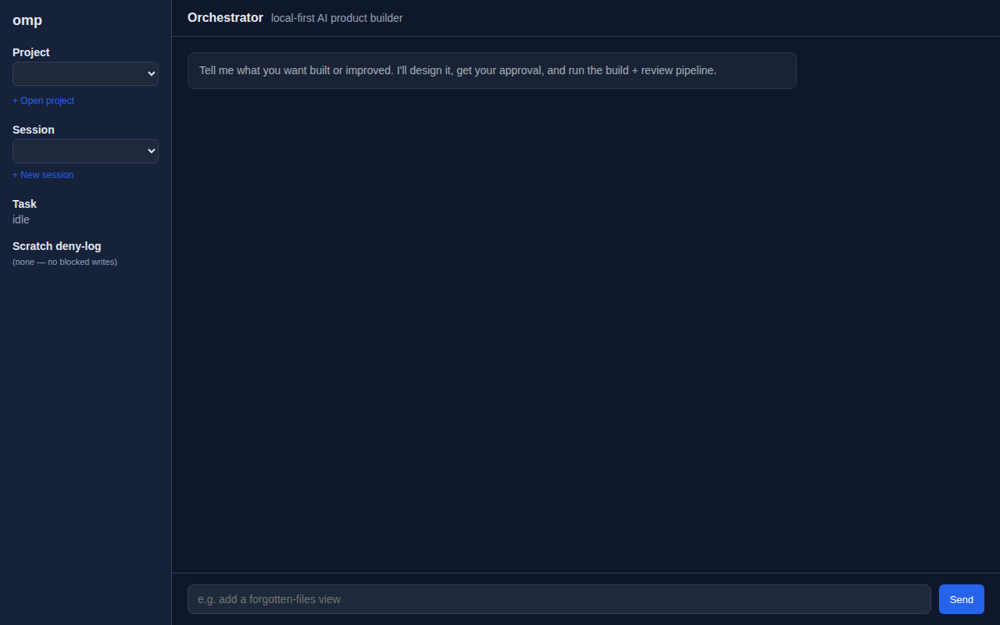
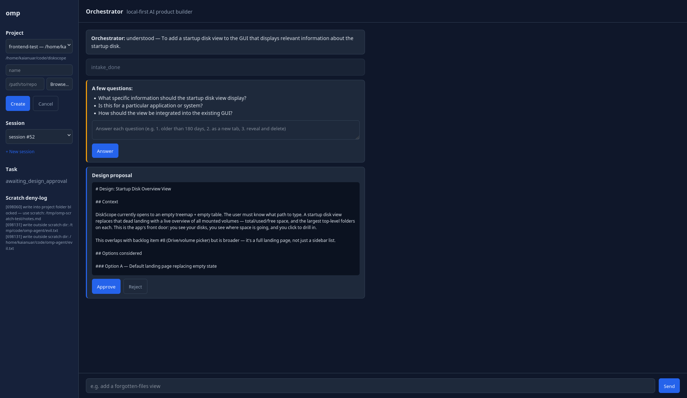
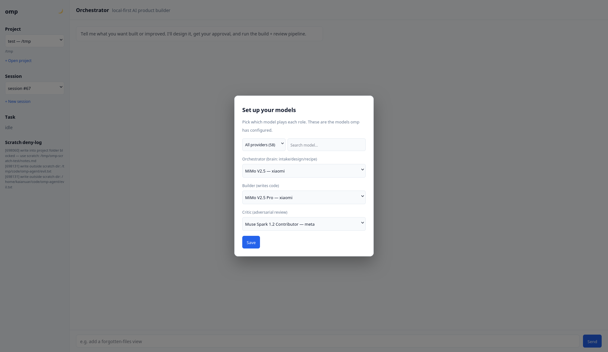

# omp-agent

A **local-first AI software studio**: open any existing codebase, talk to an
orchestrator in a chat UI, and it designs, builds, reviews, and fixes features
for you — with you approving at every checkpoint.

```
Web UI (chat + cards + approve/reject)
   ↓  one websocket (JSON-RPC + live events)
Orchestrator (read-only brain: research, design, recipe, verify)
   ↓  dispatches recipes
Pipeline (omp builder → critic review → auto-fix → verify → PR)
```

- **Open any existing folder** (browse dialog or path) — it learns the repo
  from its AGENTS.md / README / backlogs.
- **Conversational**: tell it what you want ("add a junk detector", "the dupes
  panel feels cluttered"), answer its clarifying questions, approve the design.
- **Adjustable designs**: not happy with the proposal? Hit **Adjust…**, tell it
  what to change, and it regenerates the design addressing your feedback.
- **Review-gated**: a critic reviews every PR (P0-P4) with the findings shown
  inline — and the builder auto-fixes blockers before it comes back to you.
- **Live**: everything streams over one WebSocket — intake, design, build
  progress (commits as they land), PR + diff, critic verdicts, verify
  checklist — no polling, no page reloads.
- **Local-first**: runs on your machine, your models, your code. The
  orchestrator can never write to your project — only to scratch (/tmp).
- **You stay in control**: cancel a long build anytime; failures surface as
  clear error cards (with a pointer to fix the provider config), not silent
  timeouts.

> The engine underneath is a fully-automated, omp-native engineering pipeline
> (test gate → adversarial review → e2e gate → steer checkpoint). See
> [PIPELINE.md](PIPELINE.md) for the engine; this README leads with the product.

## Screenshots


*The workspace: project + session pickers, live deny-log, chat composer.*


*A feature request through the loop: intake → clarifying questions → design
proposal with Approve/Reject — all streamed live over one WebSocket.*


*First-run model setup: pick which model plays each role, filtered by
provider and searchable across all of omp's models.*

## Model roles (setup wizard + settings)

On first run, a **setup wizard** asks you to pick which model plays each of
the three roles:

| Role | What it does |
|---|---|
| **Orchestrator** | The brain: intake, design, recipe |
| **Builder** | Writes the code (dispatched per recipe) |
| **Critic** | Adversarial review of every PR (P0-P4) |

- There are no baked-in defaults — the choices are **100% dependent on what
  models you have configured locally**. The wizard lists every model from
  every provider omp is configured with (`~/.omp/agent/models.yml` → each
  provider's `/models` endpoint), so it always reflects your actual catalog.
  Filter by provider, search by name.
- Choices persist to `webapp/data/roles.json` — the wizard only appears once.
- After setup, the **⚙️ settings gear** (top of the left rail) reopens the
  same picker to change roles anytime.
- The saved roles are actually used: the orchestrator's LLM calls resolve
  per-role (orchestrator / builder / critic), so changing a role changes
  which model does that job.

## Quick start (web UI)

```bash
# 1. Clone
git clone https://github.com/kaianuar/omp-agent
cd omp-agent

# 2. Backend (Python)
python3 -m venv .venv-web
.venv-web/bin/pip install -r webapp/requirements.txt

# 3. Frontend (React + Vite)
cd webapp/web && bun install && cd ../..

# 4. Run it (backend :8787, frontend :5273)
export OMP_LLM_API_KEY=...            # any OpenAI-compatible key
.venv-web/bin/uvicorn webapp.api.main:app --port 8787 &   # backend
cd webapp/web && bunx vite --port 5273 &                  # frontend

# 5. Open http://127.0.0.1:5273 — add a project (browse to a repo), start chatting.
```

That's it. Point it at a repo, ask for a feature, approve the design, watch it
build + review live.

---

## The engine: pipeline quick start (you have models configured)

For pipeline-first users (no web UI — drive omp directly):

```bash
# Scaffold a new project from the factory
./scaffold.sh ~/code/my-app --ui        # --ui also copies the UI design tokens

# Edit the goal, then let omp run the loop (see PIPELINE.md)
cd ~/code/my-app
#   - edit requirements.md  (what to build)
omp
```

That's it — fill in `requirements.md`, and omp handles the rest (including
auto-detecting your stack's test command(s)). New machine? See
[Configure your own models & providers](#configure-your-own-models--providers).

Or view the full **[USAGE.md](USAGE.md)** cheat-sheet — how to run the pipeline
yourself end to end (scaffold, omp commands, steering, troubleshooting).

---

## The loop (what the pipeline does)

```
[requirements.md]
      │
      ▼
  A. PLAN-ONLY  — builder writes plan.md (phases identified, NO code). Critic
                  (Gate 0) approves the plan before any code exists. Rejections
                  only revise the plan, never touch source.
      │  plan approved
      ▼
  B. PHASED BUILD — for each phase (Phase 1: domain → Phase 2: adapters → ...):
      │   ┌───────────────────────────────────────────┐
      │   │  builder implements deliverables           │  (no plan edits)
      │   │  (sub-chunked: ≤5 focused omp calls,      │
      │   │   or batched if more)                      │
      │   ▼                                           │
      │  GATE 1 — HARD test gate (tests/gate.sh; red = halt)   │
      │   ▼                                           │
      │  GATE 2 — ADVERSARIAL review: critic reviews │
      │           that phase's diff;                  │
      │           FAIL → feed findings back → retry   │── loop (bounded)
      │   ▼                                           │
      │  PASS → commit that phase → next phase ───────┘
      ▼
  C. GATE 3  — VISUAL + FUNCTIONAL E2E (if there's a UI): Playwright drives the
                app through its real flows + captures screenshots, and a vision
                model (commandcode/xiaomi/mimo-v2.5) reviews the UI actually renders and looks
                correct (tests/visual_gate.sh)
      │
      ▼
  D. STEER   — shows the diff for your approval before finalizing
      │
      ▼
  E. DONE
```

The full operating instructions (roles, order, hard rules) live in **`PIPELINE.md`**
— that's the file omp loads as context on every run.

`pipeline.sh` orchestrates the whole thing (plan-only → per-phase build/gates).
All gates are hard and non-skippable. omp must not self-review GATE 2 — the critic
and the visual review are separate processes.

### Interaction log

Every run writes a structured interaction log to `/tmp/omp_interaction.log`:
- Plan phase: builder task, plan content-hash, critic verdict with P1 count
- Build phases: Gate 1 test results, Gate 2 critic verdict, per-deliverable progress
- Content-hashes make stale-content bugs immediately visible

### Issue ledger

Gate 2 maintains a structured issue ledger (`/tmp/review_ledger.txt`) per phase:
- Each finding is tagged `[P0]`–`[P4]` and tracked with `OPEN`/`RESOLVED`/`BACKLOG` status
- The critic re-flags only `OPEN` items; `RESOLVED` items stay closed
- Prevents the "re-raise same issue forever" deadlock that plagued earlier versions

### Docker preflight

For projects needing native build dependencies (Tauri, GTK, etc.):
- `pipeline.sh` auto-detects the runtime (Rust/Node/Python/PHP/Go) from project manifests
- Generates a Dockerfile with the appropriate base image + system libs
- Builds a cached Docker image (`omp-env:<project>`)
- Gates run tests inside the container, eliminating host-lib blockers

---

## Why omp? (the thinking behind this setup)

The goal here is a local agent that takes a goal and drives it to completion
**reliably** — not a demo that mostly works and occasionally ships something broken.
That goal shapes every choice:

**Three things have to be hard:**
1. **The build has to actually work** — so there's a hard test gate in front of
   everything (Gate 1). Code isn't "done" because the agent says so; it's done when
   the tests pass.
2. **Someone independent has to review it** — so there's a cross-model adversarial
   review (Gate 2). The reviewer applies strict severity discipline (P0–P4 taxonomy,
   actionable `-> FIX:` remediation, respect-own-FIX contract) so it can't inflate
   severity or re-raise resolved issues.
3. **The UI has to actually render and work** — so when there's a user interface
   there's a visual + functional e2e gate (Gate 3). Playwright drives the real app
   through its flows and captures screenshots, and a vision model checks the UI
   looks correct. A diff-only review can silently bless a screen that's broken or
   bare; this gate exercises it for real.

**Why omp specifically fits this:**
- **It covers the whole loop in one tool.** omp plans, dispatches subagents, and can
  act as builder *and* reviewer. `pipeline.sh` is a thin orchestrator on top that
  splits the work into a plan-only phase and per-phase build/review — omp provides
  the agentic editing and model routing; the orchestrator just sequences the phases
  and gates.
- **Programmable.** `--mode rpc` gives a JSON/stdio interface for the non-interactive
  automation path.
- **Batteries that matter here.** Real editing primitives (hashline edits, LSP/DAP,
  git-worktree isolation) and a solid agentic loop.

**What this setup is deliberately NOT:**
- **Not an always-on "agent farm"** running 24/7 in the background. This pipeline is
  *controlled, sequential, gated* single-task execution with a human steer gate at
  the end. You give it one goal, it works until the gates pass, then it stops for
  your approval.
- **Not tied to any specific model or vendor.** Swap builder/critic freely; the
  gates and the loop are what guarantee quality.

---

## Installing & setting up omp

### 1. Install

Oh My Pi ships as a CLI. From its GitHub (`can1357/oh-my-pi`, also `omp.sh`):

```bash
# npm
npm install -g @oh-my-pi/cli

# or curl (Linux/macOS)
curl -fsSL https://omp.sh/install.sh | bash
```

Confirm it works: `omp --version`.

> Check the omp repo / omp.sh for the current, supported install command for your
> platform — it ships by shell script, npm, Bun, or PowerShell.

### 2. Point omp at your providers (API keys)

omp reads provider keys from your shell environment and its own secrets store.
At minimum set the keys for the providers you'll use:

```bash
export COMMANDCODE_API_KEY="..."            # e.g. builder + critic via CommandCode
# ... any others you use (OPENROUTER_API_KEY, DEEPSEEK_API_KEY, ...)
```

If you use Hermes and keep keys in `~/.hermes/.env`, that file is loaded into the
environment automatically.

### 3. Set your model roles

omp's model routing lives in `~/.omp/agent/config.yml` (and `~/.config/oh-my-pi/models.yml`).
Example:

```yaml
modelRoles:
  default: commandcode/xiaomi/mimo-v2.5-pro   # your builder model
  plan: commandcode/xiaomi/mimo-v2.5
```

You don't have to match this exactly — set the roles to models you have access to.

### 4. Sanity-check with a coding probe

Before trusting a model, run a tiny coding task and confirm it produces runnable
code (never trust a model's self-report). Example probe (2026-08-15):

> *"Write a Python function `dedupe_events(events)` that keeps the earliest
> timestamp per id, output ordered by first appearance in the input, and returns
> `[]` for empty input. Return only runnable code."*

If it returns correct code, the model is usable in the pipeline (see CONFIG.md rules).

### 5. Point the pipeline at your models

Edit `.omp/config.yml` (per project) for builder/plan, and the `PIPELINE_CRITIC_MODEL`
or `CRITIC_MODEL` env var for the critic. See
[Configure your own models & providers](#configure-your-own-models--providers).

---

## The model roles (what to configure)

The pipeline uses models in a few distinct roles:

1. **builder** — implements code + tests. Pick your fastest strong coder.
2. **critic** (Gate 2) — adversarially reviews the builder's diff, with strict
   severity discipline enforced through prompt rules (P0–P4 taxonomy,
   actionable `-> FIX:` lines, respect-own-FIX contract).
3. **vision** (Gate 3, optional) — checks screenshots of the running UI. A
   multimodal model works; it's used by `tests/visual_gate.sh`, not by the
   builder/critic roles.

There are no baked-in defaults — which model plays each role is **100%
dependent on what you have configured locally**. In the web UI, the first-run
**setup wizard** (and the ⚙️ settings gear after that) is where you assign a
model to each role; it lists every model from every provider omp is configured
with. Pipeline-only users set the same roles directly in omp's config — see
[Configure your own models & providers](#configure-your-own-models--providers).

---

## Configure your own models & providers

omp resolves models and credentials through **its own config** — the pipeline only
says *which role uses which model id*. So you configure providers once in your omp
setup, then point the pipeline at them.

### 1. Tell omp about your providers + keys

Providers and API keys live in your **omp environment** (not in this repo):
- omp reads API keys from your shell environment / omp's secrets store. Common vars:
  `COMMANDCODE_API_KEY`, `OPENROUTER_API_KEY`, `DEEPSEEK_API_KEY`, etc.
- Set any provider's credentials you plan to use. See omp's own docs for the exact
  key names and config file (`~/.omp/agent/config.yml`, `~/.config/oh-my-pi/models.yml`).

### 2. Pick model ids that exist in your setup

Each model is addressed as `<provider>/<model>` (e.g. `commandcode/xiaomi/mimo-v2.5-pro`).
To know what you have, list models from your providers, or run omp and pick from its model menu.

### 3. Point the pipeline at them

Edit **`.omp/config.yml`** (per project) to set your builder/plan ids:

```yaml
modelRoles:
  default: <provider>/<builder-model>     # builder
  plan: <provider>/<plan-model>
```

The critic is invoked by `tests/review_gate.sh`; it defaults to a model and can be
overridden at runtime:

```bash
PIPELINE_CRITIC_MODEL="myorg/my-critic-model" omp
# or edit the default in tests/review_gate.sh
```

### 4. Validate before trusting

Never trust a model's self-report. Run a quick coding probe (e.g. the dedupe test)
against any candidate and confirm it produces correct, runnable code before wiring it
into the pipeline. See `CONFIG.md` for the full rule set.

---

## Key rules baked in (validated, don't break them)

1. **Use a generous `max_tokens` (>= 4000) for reasoning models.** `max_tokens` is a
   CEILING — the model self-terminates when done, so a higher value doesn't waste
   tokens on short answers. It just gives reasoning enough room so the answer isn't
   truncated empty. (GATE 3's vision review also needs enough tokens.)
2. **GATE 1 runs real tests.** Never trust a model's self-reported pass — a green
   test suite is the only green.
3. **GATE 3 runs real flows + a real vision check.** Never trust "the code compiles"
   as proof a screen works — Playwright exercises it and a vision model checks it.
4. **Watch provider rate limits** (some providers 403 under load).
5. **Builder scaffold must be minimal.** Never pre-scaffold application code or
   design decisions — the builder writes everything from `requirements.md`.
   Only pipeline infrastructure is scaffolded.
6. **Respect the severity discipline.** P0/P1 = concrete build/requirement defects.
   Documentation/completeness nits are P2/P3, never block. A `-> FIX:` line is a
   contract — if satisfied, the finding is RESOLVED and must not be re-raised.

---

## Repository layout

```
omp-agent/
├── scaffold.sh          # FACTORY — replicate this setup into a new project
├── run-gates.sh         # HARD dual-gate runner (GATE 1 + GATE 2, sources project .env)
├── pipeline.sh          # fully-automated loop (plan → sub-chunked phases → gates)
├── PIPELINE.md          # the operating loop omp follows
├── PIPELINE_AUDIT.md    # full data-flow audit, handoffs, and risks
├── CONFIG.md            # the repo-author's validated model choices + rules
├── USAGE.md             # how to drive the whole thing yourself
├── PROJECTS.md          # apps built with omp-agent (live showcase)
├── requirements.md      # goal template (edit per project)
├── design-system/
│   └── tokens.json      # UI design tokens (screen consistency)
├── tests/
│   ├── gate.sh          # GATE 1 — hard test gate (auto-detects stack(s), runs tests)
│   ├── review_gate.sh   # GATE 2 — adversarial review (P0–P4, issue ledger, -> FIX)
│   ├── visual_gate.sh   # GATE 3 — Playwright functional e2e + vision screenshot review
│   ├── gate0_plan_review.sh  # GATE 0 — plan review (before any code exists)
│   ├── pipeline_self_test.sh # 26 self-tests for pipeline logic
│   ├── lib/
│   │   └── review_ledger.py  # issue ledger logic (OPEN/RESOLVED/BACKLOG)
│   └── e2e/             # Playwright spec templates + config for GATE 3
└── .omp/
    └── config.yml       # modelRoles (EDIT to your models)
```

---

## Setup / prerequisites

- **Oh My Pi** (`omp`) installed and configured.
- At least one provider key (e.g. `COMMANDCODE_API_KEY`) for the critic, plus a builder model.
  See [Configure your own models & providers](#configure-your-own-models--providers).
- **Docker** (optional but recommended) for projects needing native build dependencies
  (Tauri, GTK, etc.). The pipeline auto-detects the runtime and builds a container.
- **GATE 3 (visual/e2e) needs a browser + a vision model.** `tests/visual_gate.sh`
  installs `@playwright/test` + Chromium on first run and uses a vision model
  (`VISION_MODEL`, default `commandcode/xiaomi/mimo-v2.5`) to review screenshots.
  Only needed if the deliverable has a UI.

---

## License

[MIT](LICENSE) © kaianuar
